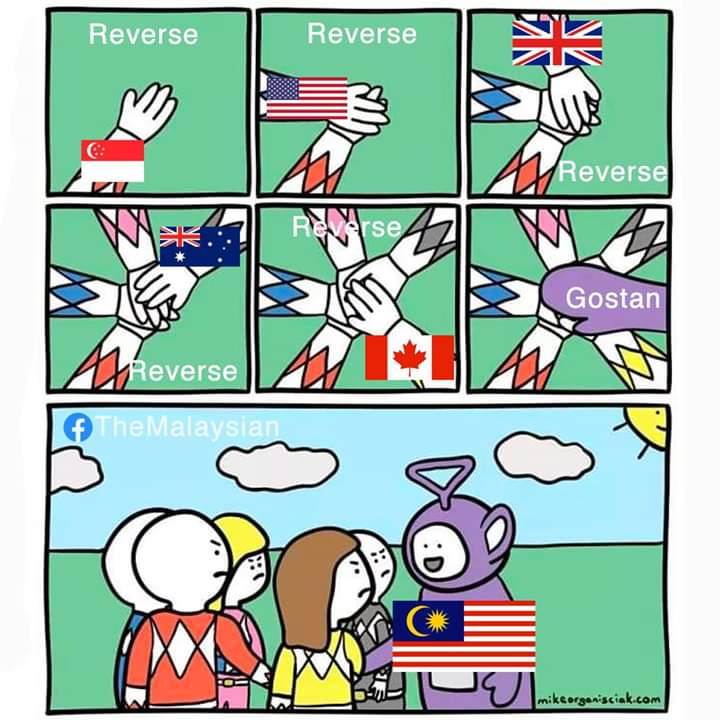

# gostan

gostan, a Malaysian slang word, meaning "go astern" or go backward is a file reverse reader 
The idea was borrowed from the 'tac' unix command.
In short, it sets the file read position to the end of file and start
looking for line separator (\n), fill the characters to buffer
and output it as the pipe writer. So you need to create an io.Pipe() first and
read the data stream from io.PipeReader



## Installation

```bash
go get github.com/zarulzakuan/gostan
```

```go
package main

import (
	"github.com/zarulzakuan/gostan"
)
...
```

## Example

See gostan_test.go


Todo: Allow other char(s) than \n as line separator

---

